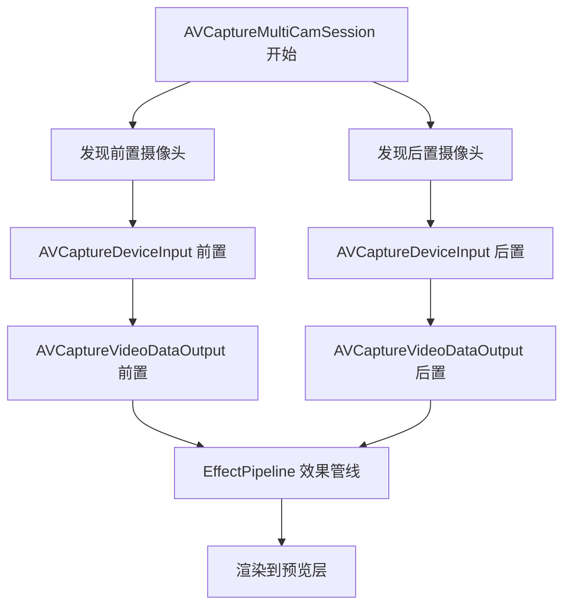
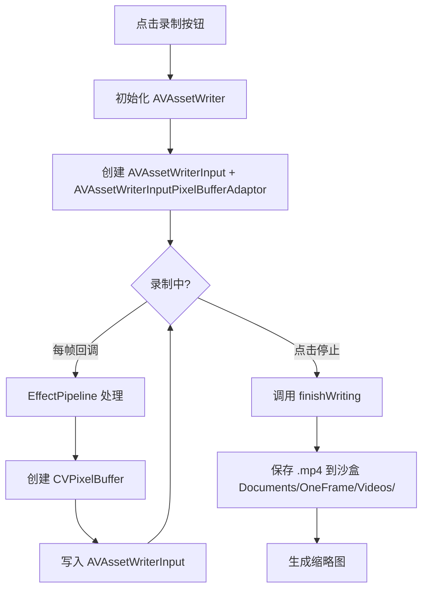
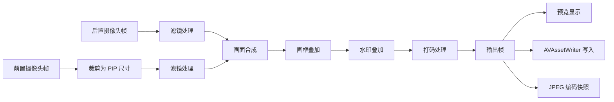

# OneFrame 同框相机 - 开发计划

## 需求概述

"同框"相机 - 同时采集前后两个摄像头画面，以画中画（PIP）方式叠加合成，支持实时滤镜/画框/水印/打码，保存为图片或视频。内置 StoreKit 2 内购去水印，支持 App 内语言切换。

### 确认的核心设计决策

| 决策项 | 方案 |
|--------|------|
| PIP 布局 | 前置摄像头小窗叠加，位置和大小可拖动调整 |
| 编辑流程 | 实时预览，所见即所得 |
| 拍摄模式 | 支持拍照 + 录像 |
| 打码方式 | 手动框选区域 |
| 内购方案 | StoreKit 2 原生 |
| 最低版本 | iOS 15.0+ |
| UI 框架 | UIKit (主) + 部分 SwiftUI |

---

## 宏架构

```
┌──────────────────────────────────────────────────────────┐
│  App Layer                                               │
│  ┌──────────┐  ┌──────────┐  ┌──────────┐  ┌──────────┐ │
│  │ CameraVC │  │ GalleryVC│  │SettingsVC│  │  AboutVC │ │
│  └────┬─────┘  └────┬─────┘  └────┬─────┘  └────┬─────┘ │
│       │             │             │             │        │
├───────┼─────────────┼─────────────┼─────────────┼────────┤
│  Service Layer                                           │
│  ┌────┴──────┐  ┌──┴──────┐  ┌──┴──────┐  ┌───┴──────┐ │
│  │CameraSvc  │  │MediaSvc │  │IAP Svc  │  │LocaleSvc │ │
│  │(双摄采集)  │  │(沙盒管理)│  │(内购)   │  │(国际化)  │ │
│  └────┬──────┘  └──┬──────┘  └──┬──────┘  └──────────┘ │
│       │             │             │                      │
│  ┌────┴─────────────┴─────────────┴────────────────────┐ │
│  │  Effect Pipeline (滤镜/画框/水印/打码)               │ │
│  └─────────────────────────────────────────────────────┘ │
├──────────────────────────────────────────────────────────┤
│  System Layer                                            │
│  AVFoundation / CoreImage / CoreLocation / WeatherKit    │
│  StoreKit / Photos / UIKit / SwiftUI                     │
└──────────────────────────────────────────────────────────┘
```

---

## 模块划分

```
OneFrame/
├── AppDelegate.swift
├── SceneDelegate.swift
├── Info.plist
├── Application/                    # 应用入口与生命周期
│   ├── AppCoordinator.swift        # 主协调器
│   └── AppConfiguration.swift      # 全局配置
│
├── Modules/                        # 功能模块
│   ├── Camera/                     # 摄像头采集与预览
│   │   ├── CameraViewController.swift
│   │   ├── CameraViewModel.swift
│   │   ├── CaptureSessionManager.swift    # AVCaptureMultiCamSession
│   │   ├── PIPOverlayView.swift           # PIP 小窗可拖动手势
│   │   └── CaptureModeSelector.swift      # 拍照/录像切换
│   │
│   ├── Effects/                    # 实时效果管线
│   │   ├── EffectPipeline.swift           # CIFilter 链式处理
│   │   ├── FilterEffect.swift             # 滤镜 (黑白/胶片/复古等)
│   │   ├── FrameEffect.swift              # 画框叠加
│   │   ├── WatermarkEffect.swift          # 水印 (位置/天气/设备)
│   │   ├── MosaicEffect.swift             # 打码 (CIPixellate)
│   │   └── Compositor.swift               # 双画面合成
│   │
│   ├── Media/                      # 媒体存储与导出
│   │   ├── MediaStorageManager.swift      # 沙盒存储 CRUD
│   │   ├── MediaPreviewViewController.swift
│   │   ├── MediaDetailViewController.swift
│   │   ├── PhotoCapture.swift             # 单帧合成拍照
│   │   ├── VideoRecorder.swift            # AVAssetWriter 录像
│   │   └── AlbumExporter.swift            # 相册导出 + 分享
│   │
│   ├── Purchase/                   # 内购
│   │   ├── IAPManager.swift               # StoreKit 2
│   │   ├── IAPProduct.swift               # 商品定义
│   │   └── PurchaseViewController.swift
│   │
│   └── Settings/                   # 设置
│       ├── SettingsViewController.swift
│       ├── LanguagePickerViewController.swift
│       ├── AboutViewController.swift
│       └── PrivacyPolicyViewController.swift
│
├── Services/                       # 基础服务
│   ├── LocationService.swift              # CoreLocation 获取经纬度
│   ├── WeatherService.swift               # 天气信息 (WeatherKit)
│   ├── DeviceInfoService.swift            # 设备型号/系统版本
│   └── LanguageManager.swift              # App 内语言切换
│
├── Extensions/                     # 扩展
│   ├── CIImage+Extensions.swift
│   ├── UIImage+Extensions.swift
│   └── UIView+Extensions.swift
│
├── Resources/                      # 资源
│   ├── Localizable/                       # 国际化
│   │   ├── en.lproj/Localizable.strings
│   │   └── zh-Hans.lproj/Localizable.strings
│   ├── Frames/                            # 画框图片资源
│   └── Filters/                           # 滤镜预设 (LUT 等)
│
└── Assets.xcassets/
```

---

## 分步开发计划

### Step 1: 项目工程结构调整与基础架构搭建

**目标**: 建立清晰的目录结构，配置好基础服务和依赖。

**内容**:
- 创建上述目录结构
- 更新 `Podfile`（如需要第三方库，但目前架构可纯原生实现，暂不引入依赖）
- 配置 `Info.plist`：`NSCameraUsageDescription`、`NSMicrophoneUsageDescription`、`NSPhotoLibraryUsageDescription`、`NSPhotoLibraryAddUsageDescription`、`NSLocationWhenInUseUsageDescription`
- 实现基础服务桩代码：`LanguageManager`、`DeviceInfoService`
- 创建 `AppCoordinator` 作为根协调器
- 创建主 TabBar 结构：相机 / 相册 / 设置

---

### Step 2: 双摄像头采集模块 (CameraService)

**目标**: 使用 `AVCaptureMultiCamSession` 同时采集前后摄像头视频流。

**关键 API**:
- `AVCaptureMultiCamSession` - iOS 13+ 多摄像头会话
- `AVCaptureDeviceDiscoverySession` - 发现前后摄像头
- `AVCaptureVideoDataOutput` - 获取每帧 `CMSampleBuffer`

**核心逻辑**:



**注意事项**:
- `AVCaptureMultiCamSession` 对硬件有要求（iPhone XS/XR 及更新，大部分 iOS 15 设备支持）
- 需要处理设备不支持多摄像头的降级方案
- 前后摄像头输出分别进入独立的 `AVCaptureVideoDataOutput`

---

### Step 3: 预览画面渲染模块 (PIPOverlayView)

**目标**: 后置摄像头全屏显示，前置摄像头小窗叠加，支持拖动和缩放手势。

**关键组件**:
- `CameraViewController` - 主预览控制器
- `PIPOverlayView` - 前置摄像头 PIP 容器视图
  - `UIPanGestureRecognizer` - 拖动改变位置
  - `UIPinchGestureRecognizer` - 捏合改变大小
  - 边界限制逻辑，防止拖出屏幕
  - 默认尺寸：屏幕宽度的 1/3
  - 默认位置：右下角

**布局结构**:
```
┌──────────────────────────────┐
│                              │
│      后置摄像头 (全屏)         │
│                              │
│                ┌────────────┐│
│                │ 前置摄像头   ││
│                │ (可拖动     ││
│                │  可缩放)    ││
│                └────────────┘│
└──────────────────────────────┘
```

---

### Step 4: 实时滤镜模块 (FilterEffect)

**目标**: 对视频帧实时应用 CIFilter 滤镜链。

**滤镜列表**:
| 滤镜 | CIFilter | 参数 |
|------|----------|------|
| 原图 | 无 | - |
| 黑白 | `CIPhotoEffectMono` | - |
| 铬黄 | `CIPhotoEffectChrome` | - |
| 褪色 | `CIPhotoEffectFade` | - |
| 即时 | `CIPhotoEffectInstant` | - |
| 胶片 | `CIPhotoEffectNoir` | - |
| 怀旧 | `CIPhotoEffectProcess` | - |
| 冲印 | `CIPhotoEffectTonal` | - |
| 岁月 | `CIPhotoEffectTransfer` | - |

**技术方案**:
- 使用 `CIFilter` 内置滤镜，性能最优
- 滤镜应用在 `EffectPipeline` 中作为第一级处理
- `CIContext` 使用 Metal 后端 (`MTLCreateSystemDefaultDevice()`)

---

### Step 5: 实时画框模块 (FrameEffect)

**目标**: 在合成画面上叠加装饰性画框。

**技术方案**:
- 画框用 PNG 图片资源（透明背景 + 装饰边框）
- 使用 `CISourceOverCompositing` 将画框合成到视频帧上
- 支持多个画框样式，用户横向滑动选择
- 画框资源放在 `Resources/Frames/` 目录

---

### Step 6: 实时水印模块 (WatermarkEffect)

**目标**: 叠加包含位置、天气、设备信息、App 名称的水印文字。

**水印内容**:
| 信息 | 来源 |
|------|------|
| 时间戳 | `DateFormatter` |
| 经纬度 | `CoreLocation` |
| 地点名称 | `CLGeocoder` 逆地理编码 |
| 天气 | WeatherKit / `WeatherService` |
| 设备型号 | `DeviceInfoService` |
| 系统版本 | `UIDevice.current.systemVersion` |
| App 名称 (水印) | 固定 "OneFrame"，内购后隐藏 |

**技术方案**:
- 使用 `CoreText` / `UIGraphicsImageRenderer` 将文字渲染为 `CGImage`
- 再用 `CISourceOverCompositing` 叠加到视频帧
- 水印位置固定在画面底部
- App 名称水印居中半透明显示，仅在未购买时显示

---

### Step 7: 实时打码模块 (MosaicEffect)

**目标**: 用户在画面上拖动框选区域，对该区域应用马赛克效果。

**交互流程**:
1. 用户点击"打码"按钮进入打码模式
2. 手指在画面上拖动创建一个矩形选区
3. 选区内的内容被 `CIPixellate` 实时模糊
4. 支持多个打码区域
5. 长按已创建的选区可删除
6. 再次点击"打码"按钮确认并退出打码模式

**技术方案**:
- 使用 `CIPixellate` filter 对选区裁剪后的图像做像素化
- 选区用 `UIView` 叠加在预览层上方显示视觉反馈
- 打码坐标需映射到视频帧坐标系（考虑 PIP 缩放）

---

### Step 8: 拍照功能 (PhotoCapture)

**目标**: 渲染当前合成帧（含所有效果）并保存为 JPEG 图片。

**流程**:
1. 用户点击快门按钮
2. 获取当前前后摄像头的最后一帧
3. 经过完整的 `EffectPipeline` 处理（滤镜→画框→水印→打码→合成）
4. 输出最终 `CGImage`
5. 保存为 JPEG 到沙盒 `Documents/OneFrame/Photos/`
6. 生成缩略图用于相册列表预览

---

### Step 9: 视频录制功能 (VideoRecorder)

**目标**: 使用 `AVAssetWriter` 逐帧编码合成视频。

**流程**:


**关键配置**:
- 视频编码: H.264 (`AVVideoCodecType.h264`)
- 分辨率: 1080p
- 帧率: 30fps
- 音频: 使用 `AVCaptureAudioDataOutput` 采集麦克风音频

---

### Step 10: 沙盒存储模块 (MediaStorageManager)

**目标**: 管理拍摄的图片和视频文件，提供预览列表和元数据。

**存储结构**:
```
Documents/OneFrame/
├── Photos/
│   ├── 2026-06-02_14-30-00.jpg
│   ├── 2026-06-02_14-30-00_thumb.jpg
│   └── ...
├── Videos/
│   ├── 2026-06-02_14-31-00.mp4
│   ├── 2026-06-02_14-31-00_thumb.jpg
│   └── ...
└── metadata.json    # 媒体索引 (文件路径、类型、日期、大小等)
```

**功能**:
- CRUD 操作管理媒体文件
- 生成缩略图
- 删除过期文件
- 统计存储空间占用

---

### Step 11: 相册导出与分享 (AlbumExporter)

**目标**: 将沙盒中的媒体保存到系统相册，支持系统分享面板。

**功能**:
- 使用 `PHPhotoLibrary` 保存到系统相册
- 使用 `UIActivityViewController` 系统分享
- 支持 AirDrop、微信、保存到文件等
- 导出前检查相册权限

---

### Step 12: 内购模块 (IAPManager) - StoreKit 2

**目标**: 实现"去水印"内购功能。

**商品定义**:
| 商品ID | 类型 | 描述 |
|--------|------|------|
| `com.oneframe.remove_watermark` | Non-Consumable | 永久去除 App 名称水印 |

**StoreKit 2 核心 API**:
- `Product.products(for:)` - 获取商品
- `Product.PurchaseOption` - 购买选项
- `Transaction.currentEntitlements` - 检查已购状态
- `Transaction.updates` - 监听交易更新

**购买状态管理**:
- 购买状态存储在 `UserDefaults` + 交易验证
- App 启动时验证 `currentEntitlements`
- 水印效果根据购买状态动态显示/隐藏

---

### Step 13: 设置模块

**目标**: 提供 App 设置入口。

**设置项**:
| 设置项 | 类型 | 说明 |
|--------|------|------|
| 应用图标 | 展示 | 显示 App Icon |
| 语言切换 | 选择器 | 简体中文 / English |
| 去水印 | 内购入口 | 跳转购买页面 |
| 恢复购买 | 按钮 | StoreKit 2 restore |
| 隐私政策 | 网页 | WKWebView 加载 |
| 关于 | 页面 | 版本号、开发者信息 |
| 评分 | 按钮 | 跳转 App Store |

---

### Step 14: 国际化 (LanguageManager)

**目标**: App 内动态切换语言，无需重启。

**方案**:
- `LanguageManager` 单例管理当前语言
- 存储选择到 `UserDefaults`
- 使用 `Bundle` 扩展加载对应 `lproj` 的资源
- 支持语言: `zh-Hans` (简体中文), `en` (English)
- 切换后发送通知，所有页面刷新文案

**Localizable.strings 示例**:
```swift
// zh-Hans
"camera.photo" = "拍照";
"camera.video" = "录像";
"settings.language" = "语言";
"purchase.remove_watermark" = "去除水印";

// en
"camera.photo" = "Photo";
"camera.video" = "Video";
"settings.language" = "Language";
"purchase.remove_watermark" = "Remove Watermark";
```

---

### Step 15: 隐私权限配置

**Info.plist 必需字段**:

```xml
<key>NSCameraUsageDescription</key>
<string>OneFrame 需要使用摄像头来拍摄同框照片和视频</string>
<key>NSMicrophoneUsageDescription</key>
<string>OneFrame 需要使用麦克风来录制视频音频</string>
<key>NSPhotoLibraryUsageDescription</key>
<string>OneFrame 需要访问相册来保存您的作品</string>
<key>NSPhotoLibraryAddUsageDescription</key>
<string>OneFrame 需要将照片和视频保存到您的相册</string>
<key>NSLocationWhenInUseUsageDescription</key>
<string>OneFrame 需要获取位置信息来添加地点水印</string>
```

---

## 核心技术方案

### EffectPipeline 数据流



### 合成流程 (Compositor)

1. 后置摄像头帧全尺寸作为背景
2. 前置摄像头帧缩放到 PIP 窗口尺寸
3. 使用 `CISourceOverCompositing` 将 PIP 叠加到指定位置
4. 后续叠加画框、水印、打码

### 打码坐标系转换

```
触摸点 (view coordinates)
    → 转换为 PIP 视图内坐标
    → 映射到前置摄像头帧坐标
    → 转换为整个合成帧坐标
    → CIPixellate 应用到该区域
```

---

## 非功能需求

| 需求 | 方案 |
|------|------|
| 性能 | Metal 后端 CIContext，离屏渲染 |
| 兼容性 | 检测 AVCaptureMultiCamSession 是否可用，降级为单摄 |
| 内存 | 限制 CVPixelBuffer 池大小，及时释放帧 |
| 电量 | 录制时降低屏幕亮度，使用高效编码 |
| 存储 | 沙盒大小预警，自动清理策略 |

---

## 开发顺序建议

按依赖关系排序（TODO 列表已按此顺序排列）：

1. **基础架构** → 目录、配置、服务桩
2. **双摄采集** → 核心能力，所有模块依赖
3. **预览渲染** → iOS UI，直观可见进度
4. **效果管线** → 滤镜/画框/水印/打码
5. **媒体输出** → 拍照 + 录像
6. **存储管理** → 沙盒 + 预览
7. **导出分享** → 相册 + 系统分享
8. **内购** → StoreKit 2
9. **设置** → 语言切换、关于等
10. **国际化** → 多语言文案
11. **隐私配置** → Info.plist 权限

---

> 以上计划确认无误后，可切换到 **💻 Code 模式** 开始逐步实现。
